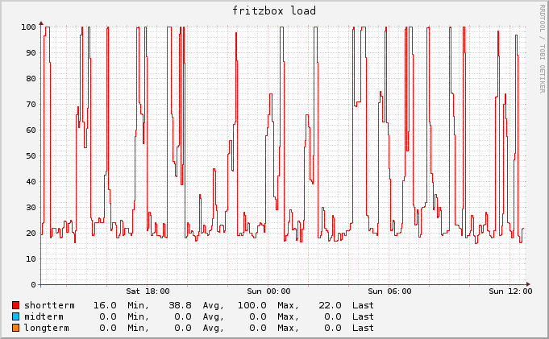
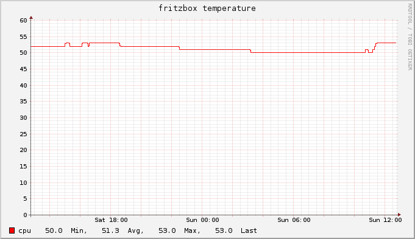
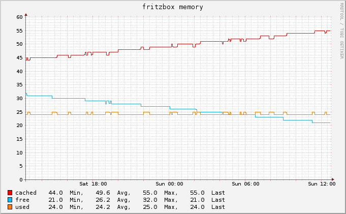
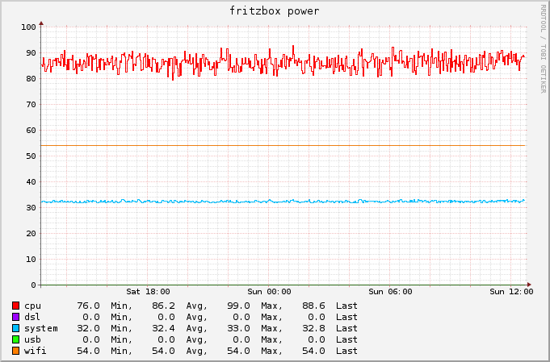
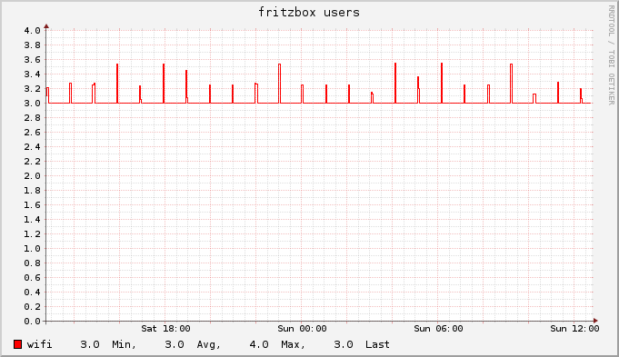

# fritzbox-munin
A collection of munin plugins to monitor your AVM FRITZ!Box router. The scripts have been developed using a FRITZ!Box 7362 SL running FRITZ!OS 06.30.
If you are using the current versio of FRITZ!OS checkout the experimental fritzos6.5 branch.

## Introduction

   These python scripts are [Munin](http://munin-monitoring.org) plugins for monitoring the [Fritz!Box](http://avm.de/produkte/fritzbox/) router by AVM.
   This repo is a fork of [https://github.com/Tafkas/fritzbox-munin](Tafkas repo) and has been modified to work with collectd and bundlewrap.
  
## fritzbox\_cpu\_usage

  fritzbox\_cpu\_usage shows you the cpu usage (requires password)  
  

## fritzbox\_cpu\_temperature

  fritzbox\_cpu\_temperature shows you the cpu temperature (requires password)  
  
  
## fritzbox\_memory\_usage

  fritzbox\_memory\_usage shows you the memory usage (requires password)  
  

##  fritzbox\_power\_consumption

  fritzbox\_power\_consumption shows you the power consumption (requires password)  
  

## fritzbox\_wifi\_devices

  fritzbox\_wifi\_devices shows you the number of connected wifi clients (requires password)
  
  

## Installation & Configuration 

0. Pre-requesites for the fritzbox\_traffic and fritzbox\_uptime plugins is the [fritzconnection](https://pypi.python.org/pypi/fritzconnection) package. To install it  
    
        pip install fritzconnection

* Do some magic with collectd and bundlewrap.
